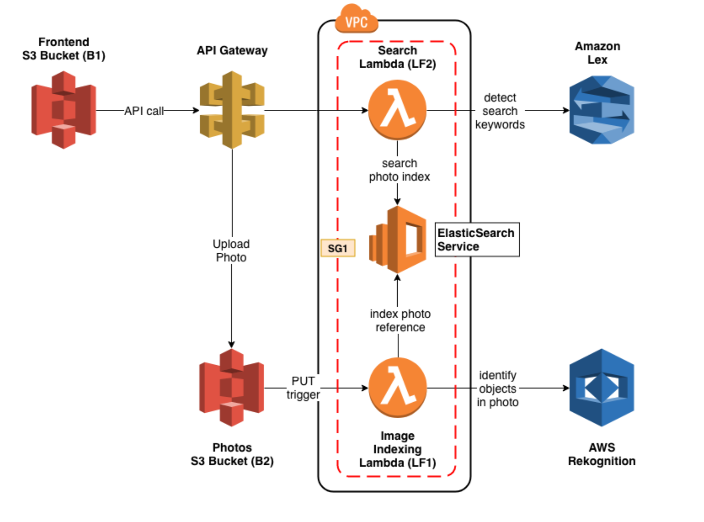

## Query based Image Retrieval Bot

In this repository we have implement a photo album web application, that can be searched using natural language through both text and voice. We have used AWS services like Lex, ElasticSearch, and Rekognition to create an intelligent search layer to query the photos for people, objects, actions, landmarks and more.

For a given photo and a given search query, a correct search is able to return every photo that matches the query. Specifically, if Rekognition returns 12 labels for a given photo, the search returns the photo for any one of those 12 labels, if searched independently (“show me ​dogs​​”) or in groups (“show me ​cats​​ and ​dogs​​”)

## Architecture

The architecture followed while making the application is shown below:




## Installation

To run the code do:

```bash
npm install
npm install aws-api-gateway-client
npm start
```

## Contributors
This project was made by [Prerna Kashyap](https://github.com/prerna135) and [Siddhant Gada](https://www.github.com/SiddhantGada) 
